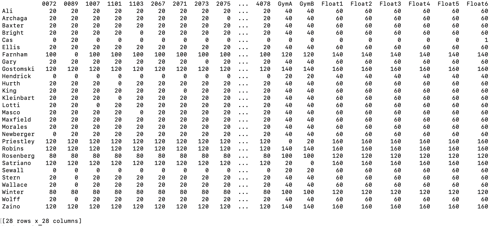

# Classroom Assignment

### Author: Rebecca Kleinbart (Hunter College) 
### Course: A.I. (CSCI 761 / CSC 740), Dr. Anita Raja, Spring 2022

### Classroom Assignment
How can teachers be assigned to classrooms in "the best" way or in a "good" way that meets hard and soft constraints prioritizing some constraints over others? This project uses a very specific set of constraints from a particular high school to illustrate and compare methods of assignment that can be applied to other settings, needs, and indeed, contexts. 

### Constraints
The constraints for this particular assignment problem came from teacher preferences, administrative preferences (acquired by interviewing teachers and administration professionals), and space limitations of a particular high school. Please see Appendix A for more details (A photo is here: https://github.com/rebecca-kleinbart/classroom_assignment/blob/1ed875507c00fefc0384360fc46cfb7bdf89ef15/images/Constraint_Tiers.png), including simplifying assumptions.  The algorithms considered can all be applied to other constraints by modifying the cost matrices and/or constraints as needed. 

Based on the constraints that emerged, this problem can be reduced to the "transportation problem". See here for more details: https://en.wikipedia.org/wiki/Transportation_theory_(mathematics). 

### Weights
In order to quantify the importance of each constraint being met, each preference was given a numerical value. A value of zero indicates that there was no issue with assigning a particular teacher to that room. In some cases particular rooms and teacher matches violated more than one constraint so these values were added. Below we can see a visual example of the cost of assigning one particular teacher, Winter, to all the available rooms. The brighter, light green represents zero cost and the darker the color, the higher the cost. 

The image below shows all of the possible matches with a weight of zero. We can see that for some teachers, more than one room has a cost of zero and for others no rooms have a cost of zero. If we had a one-to-one correspondance between teachers and rooms, of course we would not have a problem requiring artificial intelligence, or indeed any multi-step algorithms. However in this case, and many others, we need to be systematic to choose the best assignment. 

### Approach: 
We approach the Classroom Assignment in two ways: first viewing the problem as a linear combinatorial optimization problem and using AI techniques to find the minimum sum of the cost matrix. 
This first approach is further divided into two subparts: 
1a) Using depth-first-search to find the minimum cost in a search tree, improving the naive approach with backtracking, variable ordering, and pruning.
1b) Utilizing linear sum minimization techniques and attempting to speed up this process further with pruning and forward checking. 

The second approach views the problems as Constraint Satisfaction Problem and models each requirement and preference as a hard and soft constraint respectively. CSPs can also be solved more quickly with algorithmic speedups. 

#### Brute Force 
A naive approach might be to systematically try every combination and compare the weighted values, ultimately choosing the assignment(s) that have the least weight. This approach would take O(n!) in the size of the input which is clearly untenable for even medium-sized inputs, however logical and easy-to-understand. A brute force or naive approach could be implemented many ways and one way is included here. This approach has a time complexity of O(n!) so it will only run with very small inputs. 

#### Naive Plus Backtracking and Pruning 
On average, pruning can improve the naive approach by skipping any partial assignment whose cost already exceeds a complete assignment. In the worst case scenario this method would still have a time complexity of n!. A version of this method is included. 

#### Variable Ordering
Building on Naive Plus Backtracking and Pruning, a further improvement can be made by strategically ordering variables, with the teachers with the most restrictions going first. This has the advantage, at least in this classroom assignment context of being intuitive as it reflects what a human might do if assigning rooms by hand. Variable ordering is not as simple as it might seem at first glance, however, as first we must define "most restrictive" and in some cases this is not obvious. 

Below we can see a visualization of the time 

#### Constraint ordering 
Salido and Barber write about going beyond variable and value ordering to strategically ordering soft constraints using the algorithm HASCOH. 

#### Kuhn-Munkres Algorithm (also known as the Munkres or Hungarian Algorithm) 
The **Kuhn-Munkres Algorithm** is a significant improvement from the naive approach. Its running time to O(n^4) or O(n^3), depending on the variation chosen. It is a linear combinatorial optimization algorithm, _and used without modification is not an example of artificial intelligence. (insert and apply definition from R & N)_

History of this algorithm from https://en.wikipedia.org/wiki/Hungarian_algorithm: 
> The Hungarian method is a combinatorial optimization algorithm that solves the assignment problem in polynomial time and which anticipated later primal–dual methods. It was developed and published in 1955 by Harold Kuhn, who gave the name "Hungarian method" because the algorithm was largely based on the earlier works of two Hungarian mathematicians: Dénes Kőnig and Jenő Egerváry.

> James Munkres reviewed the algorithm in 1957 and observed that it is (strongly) polynomial. Since then the algorithm has been known also as the Kuhn–Munkres algorithm or Munkres assignment algorithm. The time complexity of the original algorithm was O(n^4), however Edmonds and Karp, and independently Tomizawa noticed that it can be modified to achieve an O(n^3) running time. One of the most popular O(n^3) variants is the Jonker–Volgenant algorithm. Ford and Fulkerson extended the method to general maximum flow problems in form of the Ford–Fulkerson algorithm. In 2006, it was discovered that Carl Gustav Jacobi had solved the assignment problem in the 19th century, and the solution had been published posthumously in 1890 in Latin.

Other sources: 
https://web.eecs.umich.edu/~pettie/matching/Kuhn-variants-of-hungarian-assignment.pdf 

#### Kuhn-Munkres Algorithm with Backtracking
https://www.sciencedirect.com/science/article/pii/S0304397516000037

#### Linear Sum 

### Software requirements:
Python 3.10.5 was used. 
Libraries used include networkx, matplotlib, and pandas for visualizing the bipartite graphs, numpy, pandas, and tabulate to visualize the cost matrix, itertools to create permutations, scipy for one implementation of the linear sum assignment, hungarian_algorithm for one implementation of the Kuhn-Munkres algorithm, and ortools.sat.python for a second implementation of linear sum minimization. Finally time was used to calculate running time of the different implementations of approach 1a. 

****Check to make sure no other libraries were used! ****

### How to run:

### Connections to AI topics:
This project in an example of planning. From the github repository connected with our textbook (https://github.com/aimacode/aima-python/blob/master/classical_planning_approaches.ipynb) : 
> Planning combines the two major areas of AI: search and logic. A planner can be seen either as a program that searches for a solution or as one that constructively proves the existence of a solution. Currently, the most popular and effective approaches to fully automated planning are:

> - searching using a planning graph;
> - state-space search with heuristics;
> - translating to a constraint satisfaction (CSP) problem;
> - translating to a boolean satisfiability (SAT) problem.

In this project we did a state-space search with heuristics and translated our problem to a constraint satisfaction problem. 

### Future work and next steps
#### Continue Improving Existing Approaches
We can improve the heuristics for the first approach, and more fully complete the CSP (second approach), representing all soft constraints mathematically and in our code. Also the cost matrix may be improved by returning to relevant real-world parties (teachers and administrators) and considering results and modifying as needed. 

#### Increasing complexity of constraints
For the purposes of simplification, time constraints, coteachers, and neighbor preferences were not considered. These would dramatically increase the complexity of the problem modeling, and finding solutions that take these considerations into account would make the AI assignment process even more valuable. 

#### Additional Algorithms
There are many algorithms tried with related or similar problems that could be applied to this problem as well. For instance, Deep Neural Networks, genetic algorithms and simulated annealing (see http://www.iaeng.org/IJAM/issues_v36/issue_1/IJAM_36_1_7.pdf) 

#### Selected References (see paper for complete list): 

